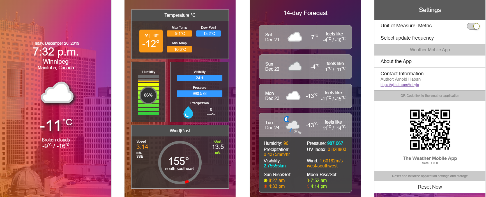

# The Weather Mobile App

>A simple weather mobile web application project using React.

Displays weather condition updates for user's current location. Easy navigation to current weather observation details and forecast information using swipe gesture controls.

#### Code and Tools
* ```JavaScript (ES6)```
* ```SCSS``` as ```CSS``` preprocessor
* ```HTML5```
* [ah-column-grids](https://github.com/hsbyte/ah-column-grids) for column grids.
* ```ReactJS``` library
* ```React``` Hooks ```useState```, ```useEffect``` and ```useLayoutEffect``` - function components
* ```Context API``` - state management
* ```Axios``` - ```HTTP``` requests
* ```Webpack``` - module bundling
* ```Babel``` - the JavaScript compiler
* ```Node.js``` - JavaScript runtime

## Features
>Basic weather forecast using current location.
* Weather observations in a card to display 14-day weather forecast
* Display board "weather ui" such as humidity, wind speed and direction and temperature gauge and meter components
* Multi-color UI elements and information graphics
* Animated weather icons

## Hosted
App only works on mobile devices, and works best with Google Chrome, Mozilla Firefox, Safari, Opera and Microsoft Edge web browsers. 
>Firebase hosted: [https://weather-mobileapp.web.app](https://weather-mobileapp.web.app)

#### Screenshot


## Author
>Arnold Haban

## Weather Api
>Weather data from [weatherbit.io](https://www.weatherbit.io/)
